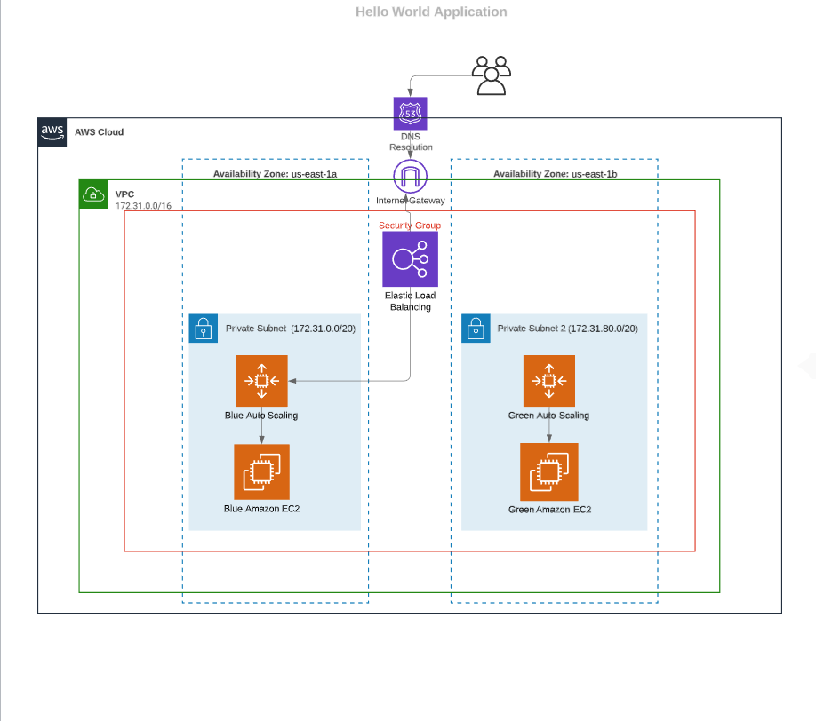

# 
Hello World Application

This is a AWS hosted Hello World application that determines the if today is a holiday in any country using the [Date Nagger](https://date.nager.at/) API. I have designed 2 version for this application:

    1. Holiday Unaware 
    2. Holiday Aware

### Infrastructure:

The whole infrastructure is hosted on Amazon Web Services.

Broad list of the AWS resources used:
* AWS Cloud Formation
* AWS Application Load Balancer
* AWS AutoScaling Group
* AWS EC2 Instance
* AWS Security Group

### Design:

1. I have implemented a public facing Application Load balancer in the default VPC. This load balancer has a listener configured to route the HTTP request towards the Target Groups.

2. There are 2 target groups designed in two different AZs, each for Holiday Aware and Holiday Unaware application. Currently the traffic is routed towards the Holiday-Aware application. This has been done to implement the Blue-Green Deployment rollback strategy which would  discussed in further.

3. To make the application fault proof, I have launched 2 AutoScaling groups in 2 different zones namely us-east-1a and us-east-1b.

### Roll-Back Strategy:

In the event of application failure, or application version update, we can always relay on the **Blue-Green deployment** strategy.

For some unforseen reason the API fails, we can configure the Application Load Balancer Listener to route the incoming requests to the fallback Green target group and once the API is up we can route the traffic to the Blue target group in a gradually increasing percentage until 100% of the traffic is rerouted towards the Holiday Aware Application. 

### Network Flow Diagram:

Before a client sends a request to the load balancer, it resolves the load balancer's domain name using a Domain Name System (DNS) server. The DNS entry is controlled by Amazon, because the load balancers are in the amazonaws.com domain. The Amazon DNS servers return one or more IP addresses to the client. These are the IP addresses of the load balancer nodes for the load balancer.

The client determines which IP address to use to send requests to the load balancer. The load balancer node that receives the request selects a healthy registered target and sends the request to the target using its private IP address.

Routing Algorithm:
The Application Load Balancer node that receives the request uses the following process:

1. Evaluates the listener rules in priority order to determine which rule to apply.

2. Selects a target from the target group for the rule action, using the routing algorithm configured for the target group. The default routing algorithm is round robin. 

